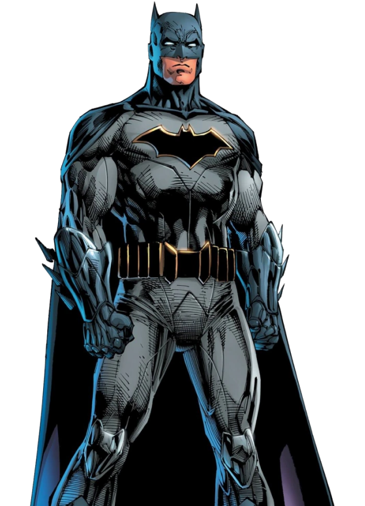

# Batman
<!DOCTYPE HTML>
  <html lang="ru">
  <head>
    <meta charset="utf-8">
    <meta http-equiv="X-UA-Compatible" content="IE=edge">
    <meta name="viewport" content="width=device-width, initial-scale=1">
    <title>Final</title>
    <link rel="stylesheet" href="style.css">
    <link rel="preconnect" href="https://fonts.gstatic.com">
  </head>
  <body>
    
    <header>
             
<a href="index.html">  
            

             </a>
             <nav>
             <ul class="nav_section main-nav">
     <li class = "header_item "><a href="#" style="color:white;">MAIN</a></li>
      <li class = "header_item "><a href="#">ABOUT</a></li>
     <li class = "header_item "><a href="#">PRODUCTS</a></li>
      <li class = "header_item"><a href="#">PARTENERS</a></li>
             </ul>
             </nav>
             </header>
  <main>
    

     <h1>WHERE  THE DETONATOR?</h1>
     

     

      
      

     </main>
  </body>
</html>
